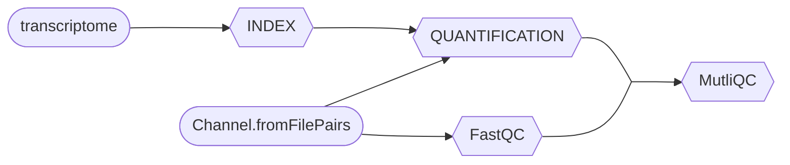

# Basic RNA-Seq processing workflow

## RNA sequencing (RNA-Seq)

&nbsp;&nbsp;&nbsp;&nbsp;RNA sequencing consists on isolating RNA from samples and fragmenting these molecules so that they are fit for [Illumina sequencing](https://www.illumina.com/science/technology/next-generation-sequencing/sequencing-technology.html). Then, these molecules are reversebly transcribed into complementary DNA (cDNA), which is more stable than RNA. cDNA is prepared for sequencing by ligating adapters. Finally, the samples are ready to be sequenced.

| 
|:--:| 
| *RNA sequencing steps. Source: https://microbenotes.com/rna-sequencing-principle-steps-types-uses/* |

&nbsp;&nbsp;&nbsp;&nbsp;Sequencing results in FASTQ files, examplified below:

```
@SEQ_ID
GATTTGGGGTTCAAAGCAGTATCGATCAAATAGTAAATCCATTTGTTCAACTCACAGTTT
+
!''*((((***+))%%%++)(%%%%).1***-+*''))**55CCF>>>>>>CCCCCCC65
```

&nbsp;&nbsp;&nbsp;&nbsp;The first is the sequence name (header). The second line is the nucleotide sequence itself. The third line is, optionally, the header again. The last line is consists of sequencing quality values according to the [Phred scale](https://en.wikipedia.org/wiki/Phred_quality_score) for each nucleotide in line 2.

&nbsp;&nbsp;&nbsp;&nbsp;In the case of [paired end sequencing](https://www.illumina.com/science/technology/next-generation-sequencing/plan-experiments/paired-end-vs-single-read.html#:~:text=Paired%2Dend%20DNA%20sequencing%20reads,insertions%2C%20deletions%2C%20and%20inversions.), there are two types of FASTQ files: R1 (forward) and R2 (reverse).

## Workflow parameters

&nbsp;&nbsp;&nbsp;&nbsp;The workflow parameters are defined in the block of code below. They include the FASTQ files path (`params.reads`), the reference transcriptome file (`params.transcriptome_file`), the MultiQC results directory (`params.multiqc`) and the output directory (`params.outdir`). 

```
// Define parameters
params.reads = "$projectDir/data/ggal/gut_{1,2}.fq"
params.transcriptome_file = "$projectDir/data/ggal/transcriptome.fa"
params.multiqc = "$projectDir/multiqc"
params.outdir = "results"

// Print parameters on-screen
log.info """\
    R N A S E Q - N F   P I P E L I N E
    ===================================
    transcriptome: ${params.transcriptome_file}
    reads        : ${params.reads}
    outdir       : ${params.outdir}
    """
```

## First process: Indexing

&nbsp;&nbsp;&nbsp;&nbsp;The first process of this workflow is indexing a reference transcriptome, which involves adressing a specific identifier to each transcript, so that the algorithms can quickly retrive sequences information.

&nbsp;&nbsp;&nbsp;&nbsp;The input data is the path to the reference transcriptome file. The output is the `salmon_index` directory and the script is the [Salmon](https://bioinformaticshome.com/tools/rna-seq/descriptions/Salmon.html#gsc.tab=0) index command.

```nextflow
process INDEX {
    input:
    path transcriptome

    output:
    path 'salmon_index'

    script:
    """
    salmon index --threads $task.cpus -t $transcriptome -i salmon_index
    """
}
```

&nbsp;&nbsp;&nbsp;&nbsp;We can already start writing the workflow scope. In the block of code below, `params.transcriptome_file` is used as input for the `INDEX` process. The results are stored in the `index_ch` channel.

```nextflow
workflow {
    index_ch = INDEX(params.transcriptome_file)
}
```

&nbsp;&nbsp;&nbsp;&nbsp;Also, we need to include a `nextflow.config` file that configures the Salmon Docker image:

```
process.container = 'nextflow/rnaseq-nf'
docker.runOptions = '-u $(id -u):$(id -g)'
docker.enabled = true
```

## Second process: Quantifying

&nbsp;&nbsp;&nbsp;&nbsp;The second process consists on quantifying the paired-end reads against the indexed reference transcriptome. The script takes each sample ID and the path to its reads as input and creates a directory for each sample to be used as the output folder. 

```nextflow
// Quantify paired-end reads against the indexed reference transcriptome
process QUANTIFICATION {
    tag "Salmon on $sample_id" // print the sample 
    publishDir params.outdir, mode:'copy' // add directory to store results

    input:
    path salmon_index
    tuple val(sample_id), path(reads)

    output:
    path "$sample_id"

    script:
    """
    salmon quant --threads $task.cpus \
        --libType=U \
        -i $salmon_index -1 ${reads[0]} -2 ${reads[1]} \
        -o $sample_id
    """
}
```

&nbsp;&nbsp;&nbsp;&nbsp;Let's add the workflow scope:

```nextflow
workflow {

    index_ch = INDEX(params.transcriptome_file)

    // Create `read_pairs_ch` with paired FASTQ files
    Channel
        .fromFilePairs(params.reads, checkIfExists: true)
        .set { read_pairs_ch }

    quant_ch = QUANTIFICATION(index_ch, read_pairs_ch)

}
```

## Third process: FastQC

&nbsp;&nbsp;&nbsp;&nbsp;This process creates files with sequencing quality visualization for each sample.

```nextflow
process FASTQC {
    tag "FASTQC on $sample_id"

    input:
    tuple val(sample_id), path(reads)

    output:
    path "fastqc_${sample_id}_logs"

    script:
    """
    mkdir fastqc_${sample_id}_logs
    fastqc -o fastqc_${sample_id}_logs -f fastq -q ${reads}
    """
}
```

## Fourth process: MultiQC

&nbsp;&nbsp;&nbsp;&nbsp;This process creates a `.html` file from FastQC results.

```nextflow
process MULTIQC {
    publishDir params.outdir, mode:'copy'

    input:
    path '*'

    output:
    path 'multiqc_report.html'

    script:
    """
    multiqc .
    """
}
```

&nbsp;&nbsp;&nbsp;&nbsp;Now, let's add the workflow scope for both FastQC and MultiQC:

```nextflow
workflow {
    Channel
        .fromFilePairs(params.reads, checkIfExists: true)
        .set { read_pairs_ch }

    index_ch = INDEX(params.transcriptome_file)
    quant_ch = QUANTIFICATION(index_ch, read_pairs_ch)
    fastqc_ch = FASTQC(read_pairs_ch)
    MULTIQC(quant_ch.mix(fastqc_ch).collect())
}
```

## Overview


