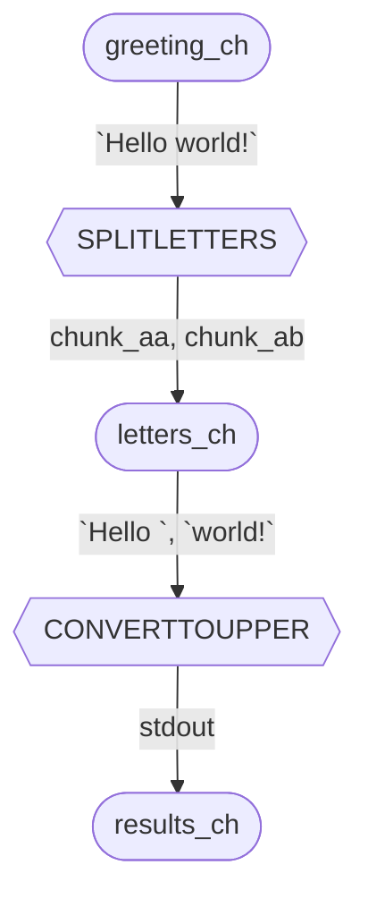

# *Hello, world!* script

`hello.nf` is a Nextflow script that displays "HELLO WORLD" on-screen. 

Let's analyze it line-by-line:

## The script

### Input channel

```nextflow
#!/usr/bin/env nextflow  
# Set Nextflow as the interpreter 

# Export `Hello world!` into the `params.greeting` variable
params.greeting = 'Hello world!'

# Create input channel `greetin_ch` from params.greeting's value
greeting_ch = Channel.of(params.greeting) 
```

### First process: split letters

&nbsp;&nbsp;&nbsp;&nbsp;Now, the script defines its first process, called `SPLITLETTERS`, which takes an input value `x` and has an output file that starts with `chunk_*`. 

&nbsp;&nbsp;&nbsp;&nbsp;Note the bash chunk of code between three double quotes after `script`! It uses the `x` variable as input of the `printf` function, which formats the text. Then, its output is passed to the `split` function, that splits the string into chunks of six characters due to the `-b 6` parameter. It also writes the results to output files that start with `chunk_` (`chunk_aa` and `chunk_ab`) (according to the `- chunk_` parameter).

```nextflow
process SPLITLETTERS { 
    input: 
    val x 

    output: 
    path 'chunk_*' 

    script: 
    """
    printf '$x' | split -b 6 - chunk_
    """
} 
```

### Second process: Convert to upper

&nbsp;&nbsp;&nbsp;&nbsp;Then, the second process, called `CONVERTTOUPPER` is defined. It takes an input file `y` and expects standard output as the output channel. The bash script of this process starts with `cat`, that "reads" the content in the input file. Then, the content is passed to the `tr` function as input. `tr '[a-z]' '[A-Z]'` performs uppercase conversion. Since the output channel is the standard output, this process displays `HELLO WORLD!` on-screen.

```nextflow
process CONVERTTOUPPER { 
    input: 
    path y 

    output: 
    stdout 

    script: 
    """
    cat $y | tr '[a-z]' '[A-Z]'
    """
} 
```

### Workflow

&nbsp;&nbsp;&nbsp;&nbsp;Finally, we can specify what the workflow is with the block of code below. It exports the output of the `SPLITLETTERS` process into the  `letters_ch` channel. Then, the value in `letters_ch` is the input to the `CONVERTTOUPPER` process, which has its output data passed into the `results_ch` channel. The `.flatten()` operator splits the two input files into two different elements. The values in `result_ch` is printed to screen by the `.view` operator.  

```nextflow
workflow { 
    letters_ch = SPLITLETTERS(greeting_ch) 
    results_ch = CONVERTTOUPPER(letters_ch.flatten()) 
    results_ch.view { it } 
} 
```

## Overview

&nbsp;&nbsp;&nbsp;&nbsp;The following diagram is a visual representation of the channels and processes discussed above:




> [!TIP]
> You can use another programming language instead of Bash, you just have to specify the interpreter. Example:

```
#!/usr/bin/env python
```