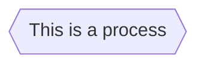
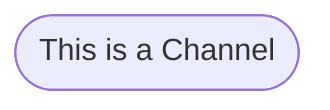
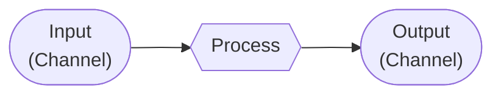
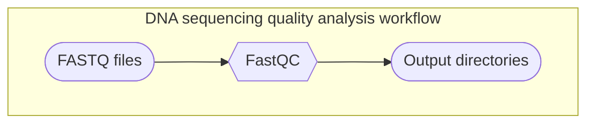

# Welcome to my           studies repository!


## Introduction

&nbsp;&nbsp;&nbsp;&nbsp;Nextflow is a free open-source programming language designed to create reproducible and scalable workflows! It is an extension of the Groovy programming language and is vastly used to orchestrate [bioinformatics](https://www.youtube.com/watch?v=W-Ov2cUaYQY) pipelines. 

> [!WARNING]
> &nbsp;&nbsp;&nbsp;&nbsp;The materials in this repository are utilized for my personal studies, derived from official [Nextflow tutorials](https://training.nextflow.io/basic_training/), and should be considered as additional resources, not substitutes.

## Installation

&nbsp;&nbsp;&nbsp;&nbsp;In order to install Nextflow on your computer, run the following command in your terminal:


```
wget -qO- https://get.nextflow.io | bash
```

&nbsp;&nbsp;&nbsp;&nbsp;Alternative:

```
curl -s https://get.nextflow.io | bash
```

&nbsp;&nbsp;&nbsp;&nbsp;Finally, make sure it is executable:

```
chmod +x nextflow
```

> [!NOTE]
> &nbsp;&nbsp;&nbsp;&nbsp;Bash, Java 11 (or later, up to 21), Git and Docker are required

## Key concepts

&nbsp;&nbsp;&nbsp;&nbsp;Nextflow workflow orchestration is based on two very important concepts: **processes** and **channels**. A Nextflow pipeline is made of multiple processes joined by channels.  

### Processes

&nbsp;&nbsp;&nbsp;&nbsp;A **process** in Nextflow can be written in any programming language executable by Linux, such as Python, Shell Bash and Ruby. A process is isolated from other processes and are executed independently. A process example is the [FastQC](https://www.bioinformatics.babraham.ac.uk/projects/fastqc/) algorithm, used to analyse DNA sequencing quality.

&nbsp;&nbsp;&nbsp;&nbsp;In this documentation, each process will be represented in diagrams by a hexagon node. A process representation is shown below:



### Channel

&nbsp;&nbsp;&nbsp;&nbsp;The only way different processes can communicate is through **channels**. In this documentation, each channel will be represented by a stadium-shaped node, as shown below:



&nbsp;&nbsp;&nbsp;&nbsp;Channels are asynchronous first-in, first-out ([FIFO](https://www.geeksforgeeks.org/fifo-vs-lifo-approach-in-programming/)) queues. Basically, every input and every output is considered a channel. 



&nbsp;&nbsp;&nbsp;&nbsp;Finally, a workflow is the execution of the pipeline made of the interaction of processes via channels. Considering the FastQC example, its input channel would be [FASTQ](https://knowledge.illumina.com/software/general/software-general-reference_material-list/000002211) files and its output channel would be output directories:

